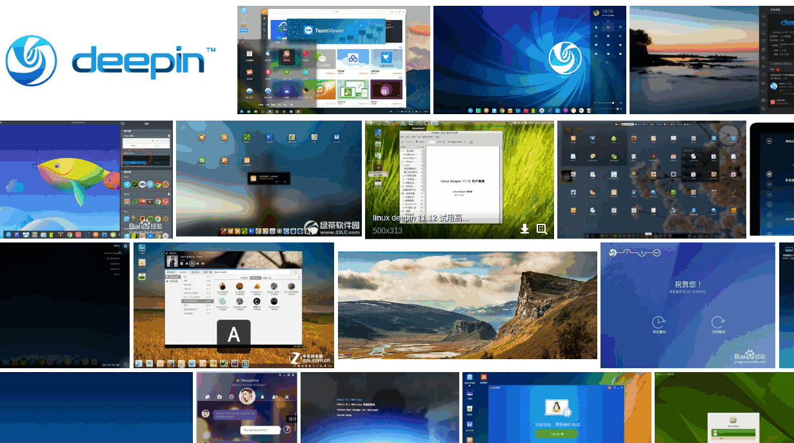
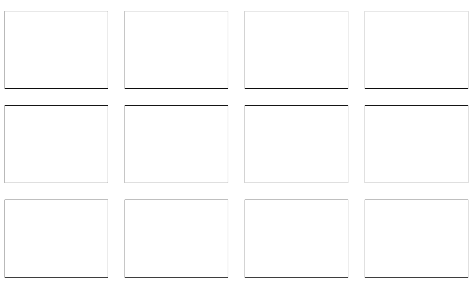
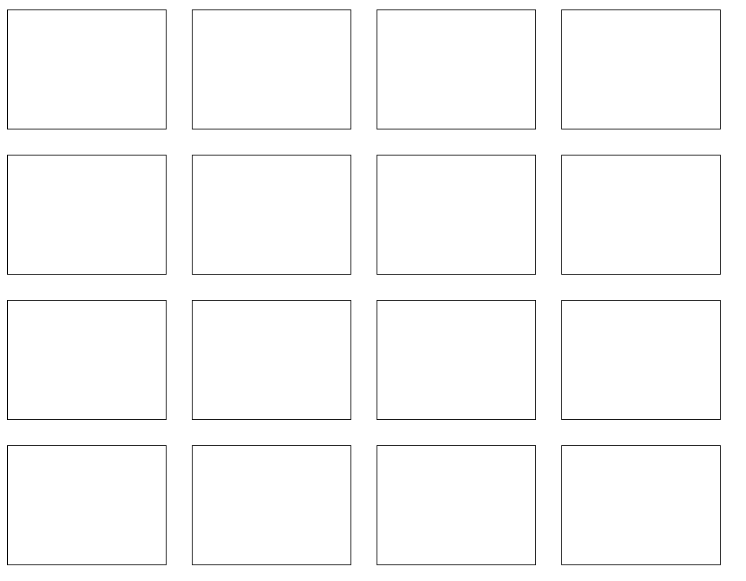

# 使用 Angular Animate

## 零

偶然中在[百度图片](http://image.baidu.com/search/index?tn=baiduimage&ps=1&ct=201326592&lm=-1&cl=2&nc=1&ie=utf-8&word=deepin)看到一个有意思的动画效果，如下图所示


正好闲来无事，就想着实现个类似的动画，也好学习下 [Angular 的动画系统](https://angular.cn/guide/animations)。

## 一

首先是分析这个动画的一些特点。

1. 鼠标悬停显示工具栏
1. 鼠标移出隐藏工具栏
1. 动画方向跟随鼠标方向

`1` 和 `2` 很容易通过 css 的 hover 伪类 实现，`3`却没办法使用 css 实现，因为 css 无法获取鼠标坐标。看来只能使用 Javascript 来实现了。

## 二

动手的第一步当然是创建个 Demo 项目，加点 css 把架子搭好。

然后添加 Angular 指令，给每个框框都附加上鼠标事件监听。
`hover.directive.ts`

```javascript
@HostListener("mouseover", ["$event"]) mouseover(e: MouseEvent){
    ...
}
@HostListener("mouseout", ["$event"]) mouseout(e: MouseEvent){
    ...
}
```

这里使用的[HostListener](https://angular.cn/api/core/HostListener)在 Angular 中用于监听宿主元素事件，`["$event"]`则是将事件对象传递到函数内。
关于判断鼠标的方向，我这里用了一个比较简单的方法，通过找到距离鼠标最近的边来判定。

```javascript
  // `x,y`分别是鼠标相对于元素的 X 坐标和 Y 坐标
  // `w,h`分别是元素的宽度和高度
  getDirection([x, y, w, h]: number[]) {
    return [
      { name: "top", value: y },
      { name: "bottom", value: h - y },
      { name: "left", value: x },
      { name: "right", value: w - x }
    ].sort((a, b) => a.value - b.value)[0].name;
  }
```

在事件回调中传递事件对象和元素对象的属性，即可得到事件方向。

```javascript
const direction = this.getDirection([
  e.offsetX,
  e.offsetY,
  this.el.offsetWidth,
  this.el.offsetHeight
]);
```

## 三

前期准备工作都完成后，就要开始写动画了。

这里我用的是 Angular 的`BrowserAnimationsModule`模块来实现动画，所以要先在`AppModule`中导入`BrowserAnimationsModule`。

```javascript

import { BrowserAnimationsModule } from "@angular/platform-browser/animations";

@NgModule({
  declarations: [AppComponent, HoverDirective],
  imports: [BrowserModule, BrowserAnimationsModule],
  providers: [],
  bootstrap: [AppComponent]
})
```

`BrowserAnimationsModule`中有两套动画系统：

1. [animations](https://angular.cn/guide/animations) 基于`CSS Animations`，使用时附加于组件的元数据中，通过切换预定义的状态来实现动画过度
1. [AnimationBuilder](https://angular.cn/api/animations/AnimationBuilder)。基于`Web Animations API`，使用时依赖`AnimationBuilder服务`，通过脚本代码动态创建动画并执行。

刚开始我是用`animations`实现了动画效果，却发现因为动画要跟随鼠标方向，使用`animations`会显得繁琐而效果也不甚满意，所以改用`AnimationBuilder`实现，代价是在老旧的浏览器上需要附带 polyfills 以支持`Web Animations API`，好在 Angular6 之后的版本会自动附带，无需任何配置。

先实现鼠标悬停动画

```javascript
  @Input("appHover") backgroundImage: string;
  @Input("timings") timings: string | number = 200;
  get positions() {
    const [w, h] = [this.el.offsetWidth, this.el.offsetHeight];
    return {
      top: `0 -${h}px`,
      bottom: `0 ${h}px`,
      left: `-${w}px 0`,
      right: `${w}px 0`
    };
  }
  @HostListener("mouseover", ["$event"]) mouseover(e: MouseEvent) {
    const direction = this.getDirection([
      e.offsetX,
      e.offsetY,
      this.el.offsetWidth,
      this.el.offsetHeight
    ]);
    this.builder
      .build([
        style({
          backgroundImage: this.backgroundImage,
          backgroundRepeat: "no-repeat",
          backgroundSize: "100% 100%",
          backgroundPosition: this.positions[direction]
        }),
        animate(this.timings, style({ backgroundPosition: "0" }))
      ])
      .create(this.el)
      .play();
  }
```

`backgroundImage`，`timings`为输入属性，用于设置背景图片和动画时间。下面是使用例子

```javascript
<div
  *ngFor="let i of arr; index as index"
  class="item"
  appHover="url(/assets/e1370ff509f36594499e5a6a98de3d6a.jpeg)"
  [timings]="'500ms ease-in-out'"
></div>
```

`positions`会根据元素宽高返回背景图初始位置，我所实现的动画过程就是在鼠标移入时，背景图会从鼠标移入方向展开。例如鼠标从元素上方移入，背景图从`{x:0, y:-100%`}移动到`{x:0, y:0}`，因为`backgroundPosition`的局限性，在设置`backgroundSize`为百分比后，无法再使用百分比确定位置，只好使用元素的宽高像素确定位置。

`builder.build`就是整个动画的关键部分了，其实是很简单的三步调用

1. 设置初始样式和动画样式
1. 绑定到当前元素
1. 执行动画

移出的动画就更好设置了，只需要将背景图移回初始位置即可。这个初始位置并不是固定的，而是根据移出方向变动的。

```javascript
  @HostListener("mouseout", ["$event"]) mouseout(e: MouseEvent) {
    const direction = this.getDirection([
      e.offsetX,
      e.offsetY,
      this.el.offsetWidth,
      this.el.offsetHeight
    ]);

    this.builder
      .build([
        animate(
          this.timings,
          style({ backgroundPosition: this.positions[direction] })
        )
      ])
      .create(this.el)
      .play();
  }
```

这样整个动画就实现了，最终效果如下


